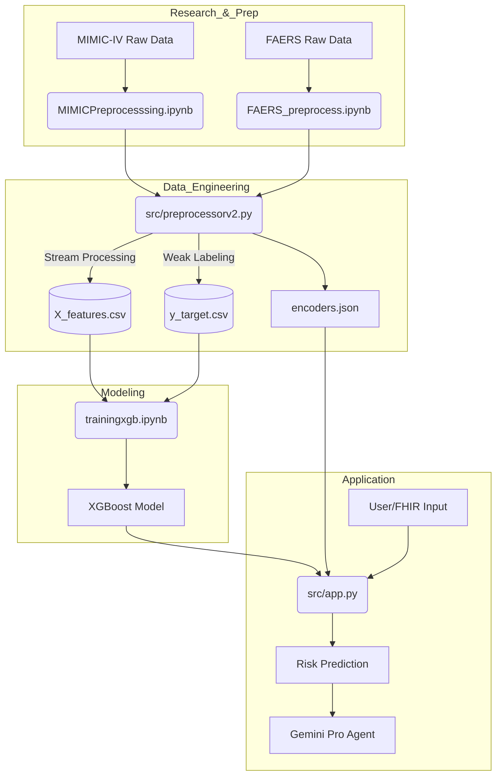

# 🏥 AI-CPA: Clinical Pharmacist Assistant (MedBot)

> **Technical Documentation & Developer Guide**
> _Advanced Adverse Drug Reaction (ADR) Prediction System using Weak Supervision & Explainable AI_

## 📋 Project Overview

**MedBot (AI-CPA)** is a clinical decision support system designed to predict and prevent Adverse Drug Reactions (ADR) in hospital settings. Unlike traditional rule-based systems, it utilizes a machine learning approach trained on **MIMIC-IV** (EHR data) and **FAERS** (FDA Adverse Event Reporting System) data.

The system employs a mixed **Notebook-to-Script** pipeline to handle massive datasets and uses **XGBoost** for efficient model training.

### Key Technical Features
*   **Weak Supervision**: Generates synthetic ground truth labels for ADRs using clinical heuristics (e.g., stopping a drug, administering an antidote, abnormal labs).
*   **Dynamic Label Encoding**: The application dynamically loads training encoders (`encoders.json`) to map user inputs to model-compatible integers.
*   **Explainable AI (XAI)**: Integrated **SHAP (SHapley Additive exPlanations)** to provide real-time feature contribution analysis for every prediction.
*   **GenAI Integration**: Uses **Google Gemini Pro** to generate actionable clinical recommendations based on risk profiles.
*   **FHIR Compliance**: capable of parsing FHIR R4 patient bundles.

---

## 🏗️ System Architecture

The following diagram illustrates the specific "True" workflow used in this project:



---

## ⚙️ Setup & Installation

### Prerequisites
*   **Python 3.9+**
*   **Google Cloud API Key** (for Gemini Pro features)

### 1. Clone & Install
```bash
git clone <repository_url>
cd medbot
pip install -r requirements.txt
```

### 2. Environment Configuration
Create a `.env` file in the root directory:
```bash
GOOGLE_API_KEY=your_api_key_here
```

### 3. Directory Structure
*   `colabupload/`: Place your raw MIMIC/FAERS CSV files here.
*   `output/ml_ready/`: Output location for processed ML features.
*   `models/`: Storage for trained XGBoost models.

---

## 🚀 Data Pipeline

The data pipeline consists of three specific stages, moving from exploratory notebooks to a production-ready streaming script.

### Stage 1: Initial MIMIC Processing (`MIMICPreprocesssing.ipynb`)
This Jupyter Notebook matches raw MIMIC-IV tables (Prescriptions, Admissions, Labs) and performs initial cleaning and exploration. It establishes the baseline for how data is structured.

### Stage 2: FAERS Data Cleaning (`FAERS_preprocess.ipynb`)
Processes the FDA Adverse Event Reporting System data to create a high-risk drug dictionary. It calculates:
*   **ADR Rate**: Frequency of adverse reactions per drug.
*   **Severe Outcome Rate**: Likelihood of severe outcomes (hospitalization, death).

### Stage 3: Streaming Feature Engineering (`src/preprocessorv2.py`)
A standalone Python script that performs the heavy lifting. It uses a **Stream-to-Disk** approach:
*   **Input**: Outputs from Stage 1 & 2.
*   **Operation**: Reads massive prescription files in chunks (`chunksize=50000`), merges them with lookup tables (Labs/Vitals) in-memory, and writes the result to disk immediately.
*   **Output**: `X_features.csv`, `y_target.csv`, and `encoders.json`.

---

## 🧠 Model Training: `trainingxgb.ipynb`

This Jupyter Notebook contains the training logic for the XGBoost model.

*   **Algorithm**: XGBoost (Gradient Boosted Trees).
*   **Optimization**: Uses a histogram-based tree method (`tree_method='hist'`) for efficiency.
*   **Evaluation**: Calculates AUC-ROC, Precision, Recall, and F1-score to validate the model's performance on the synthetic ADR labels.

---

## 🖥️ Application Layer: `src/app.py`

The frontend is built with **Streamlit** for rapid prototyping and interactivity.

### Key Components
1.  **Dynamic Label Encoding**:
    *   The app loads `colabupload/encoders.json` at startup.
    *   It maps human-readable UI inputs (e.g., "Emergency", "White", "Medicare") to the specific integers used during training, ensuring 100% consistency between training and inference data.
2.  **`page_dashboard()`**: The main clinical view.
    *   **Risk Engine**: Calculates risk score using the trained XGBoost model.
    *   **Visuals**: Gauge Chart for risk severity.
3.  **`src/clinical_agent.py`**: Connects to the **Gemini Pro API**. It constructs a prompt with the patient's context and the model's risk prediction to generate human-readable clinical interventions.

**Run App:**
```bash
streamlit run src/app.py
```

---

## 📂 File Manifest

| File | Description |
| :--- | :--- |
| `src/app.py` | Main Streamlit application. |
| `src/preprocessorv2.py` | Stage 3: Streaming data processing script. |
| `MIMICPreprocesssing.ipynb` | Stage 1: Initial MIMIC data exploration. |
| `FAERS_preprocess.ipynb` | Stage 2: FAERS data cleaning. |
| `trainingxgb.ipynb` | XGBoost Model Training Notebook. |
| `src/clinical_agent.py` | Interface for Google Gemini Pro (LLM). |
| `colabupload/encoders.json` | JSON mapping for categorical features (Critical). |
| `src/explainability.py` | SHAP wrapper for model interpretability. |
| `requirements.txt` | Python dependency list. |

---

## 🛡️ License & Disclaimer

**Disclaimer**: This software is for **Research & Demonstration Purposes Only**. It is not a certified medical device and should not be used for primary clinical diagnosis or treatment without validation.
